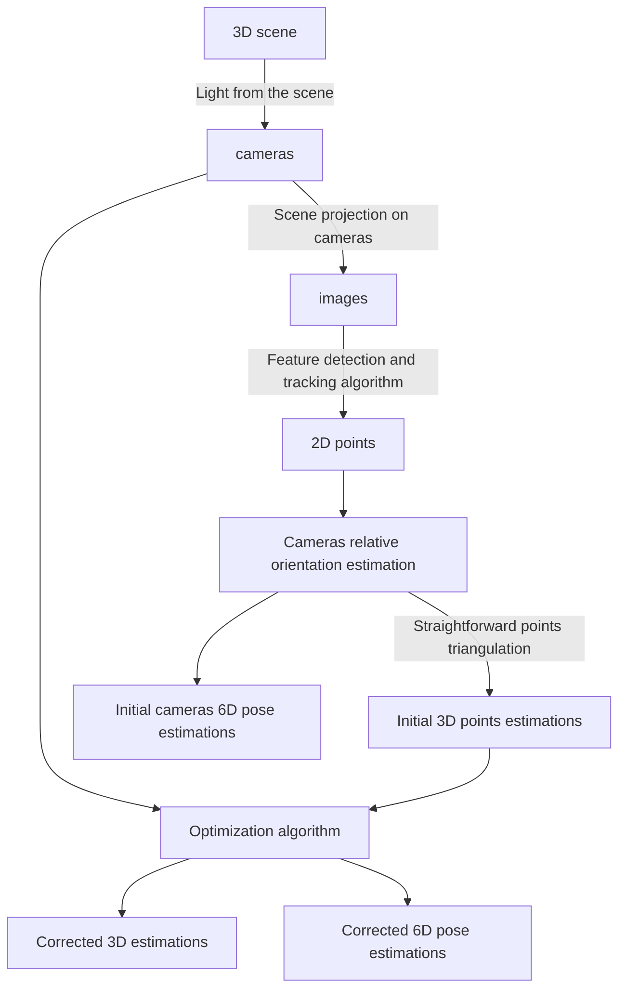
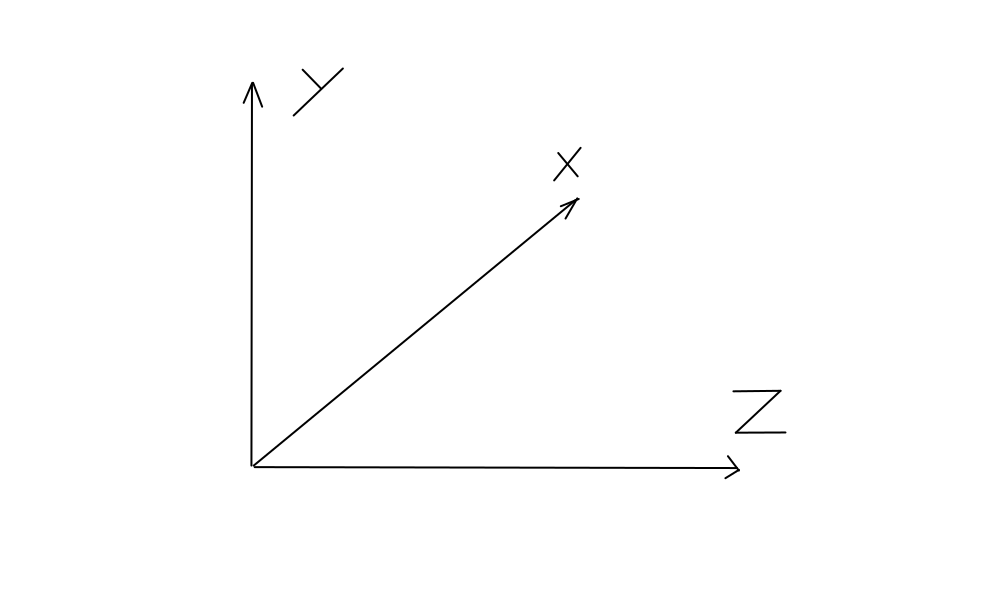

# video_to_3d_model
A project dedicated to 3D reconstruction from video sequence

# High-level algorithm description

## 3D scene

3D scene is agreed to be represented in right-hand coordinate system, i.e.:

## Cameras and scene projection

Cameras are agreed to be represented by Pinhole camera model, that is camera's intrinsic parameters are represented by 3x3 matrix K:

$$ 
\begin{pmatrix} 
f_{x} & 0 & c_{x} \\ 
0 & f_{y} & c_{y} \\
0 & 0 & 1 
\end{pmatrix}
$$

Camera rotation is agreed to be right-handed

Given that  

$$ 
\begin{pmatrix*}[l] 
t_x & t_y & t_z 
\end{pmatrix*}^T = \boldsymbol{t_c} 
$$ 

is camera center coordinates in world coordinate frame and  

$$ 
\begin{pmatrix*}[l] 
\theta_{roll} & \theta_{pitch} & \theta_{yaw} 
\end{pmatrix*}^T
$$  

are Euler rotation angles (extrinsic or intrinsic) representing camera orientation in world coordinate frame we can define 3D point's  

$$ \boldsymbol{p} = 
\begin{pmatrix*}[l] 
p_x & p_y & p_z , 1
\end{pmatrix*}^T
$$  

projection  

$$ \boldsymbol{p'} = 
\begin{pmatrix*}[l] 
p_u & p_v, 1 
\end{pmatrix*}^T
$$  

on camera written in homogeneous coordinates as:

$$
\it p' = K \cdot R \cdot p
$$

### Camera model and parametrization

### Extrinsics

1. $ 
\begin{pmatrix} 
t_x & t_y & t_z 
\end{pmatrix}^T = \boldsymbol{t_c} 
$   

- camera center coordinates in world.

2. $ 
\begin{pmatrix*}[l] 
\theta_{roll} & \theta_{pitch} & \theta_{yaw} 
\end{pmatrix*}^T
$   

- Euler rotation angles (extrinsic or intrinsic) representing camera orientation in world. Extrinsic rotations are rotation around fixed world axes. Intrinsic rotations are rotations around camera axes.

World coordinate axes and rotations are **right-handed**. Camera orientation is set up by rotation matrix $ \boldsymbol{R}$ with rotation sequence roll (z) -> pitch (x) -> yaw (y):

$$   
\boldsymbol{R^{ext}}(\theta_{roll},\theta_{pitch}, \theta_{yaw})  = \boldsymbol{R_{yaw}}(\theta_{yaw}) \cdot 
\boldsymbol{R_{pitch}}(\theta_{pitch}) \cdot 
\boldsymbol{R_{roll}}(\theta_{roll})  
$$    

$$   
\boldsymbol{R^{int}}(\theta_{roll},\theta_{pitch}, \theta_{yaw})  = \boldsymbol{R_{roll}}(\theta_{roll}) \cdot 
\boldsymbol{R_{pitch}}(\theta_{pitch}) \cdot 
\boldsymbol{R_{yaw}}(\theta_{yaw})  
$$

Respective transformation matrix $ \bold M_{w2c} $ for changing coordinate system from world axes to camera axes is given as:
$$ \bold M_{w2c} = \bold R^T(\theta_{roll},\theta_{pitch}, \theta_{yaw}) $$

In homogeneous form point $\bold \it p_w = \begin{pmatrix} x_w & y_w & z_w & 1 \end{pmatrix}^T $ in world axes transforms to camera axes as point $\bold \it p_c = \begin{pmatrix} x_c & y_c & z_c & 1 \end{pmatrix}^T $:
$$ \begin{pmatrix} x_c \\ y_c \\ z_c \\ 1\end{pmatrix} = \begin{pmatrix} \bold M_{w2c} & \bold - M_{w2c} \cdot \bold \it t_c \\ 0_{1 \times 3} & 1 \end{pmatrix} \cdot  \begin{pmatrix} x_w\\ y_w\\ z_w\\ 1 \end{pmatrix}$$

### Intrinsics

### Projection on camera

## Feature detection and tracking

## Cameras relative orientation recovery

## Points triangulation

## Optimization approach
-